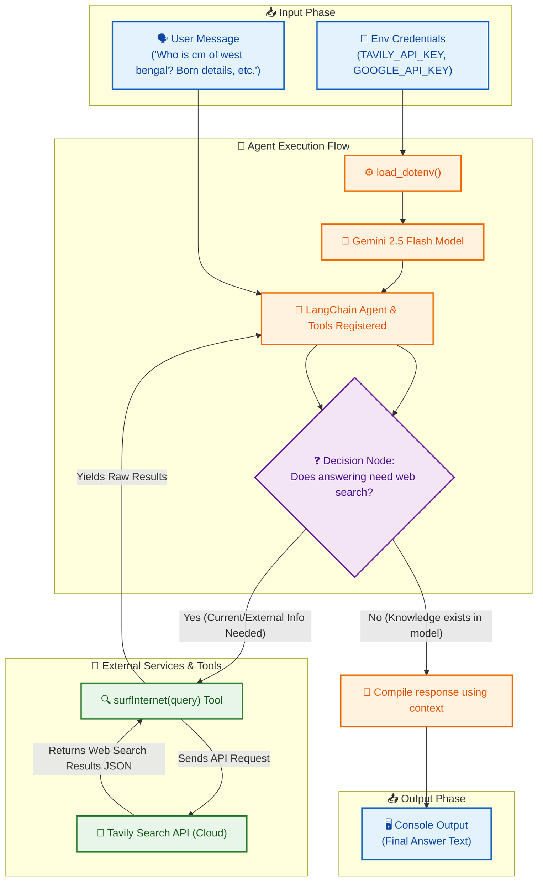

# LangChain Web Search Agent 🌐🤖

A smart conversational agent built using **LangChain**, powered by Google's **Gemini 2.5 Flash** model, and integrated with the **Tavily Search API** for real-time web browsing capabilities.

---

## 📊 System Flow & I/O Diagram

The flowchart below represents how data flows between the user, the LangChain agent, the Gemini model, and the external Tavily Search tool:



---

## 🛠️ Features

- **Real-Time Web Search**: Utilizes Tavily search to fetch the latest online information.
- **State-of-the-Art LLM**: Powered by `gemini-2.5-flash` for fast, accurate response generation.
- **Agentic Workflow**: Automatically determines whether it needs to search the web or answer from the model's native knowledge.
- **Clean Structure**: Secure token management with dotenv support.

---

## 🚀 Getting Started

### 1. Prerequisites
Ensure you have Python 3.9+ installed.

### 2. Installation
Clone this repository and install the dependencies:
```bash
# Clone the repository
git clone https://github.com/hsachan295-source/langchain-web-search-agent.git
cd langchain-web-search-agent

# Create virtual environment
python -m venv venv

# Activate virtual environment
# On Windows:
venv\Scripts\activate
# On macOS/Linux:
source venv/bin/activate

# Install required packages
pip install langchain langchain-google-genai tavily-python python-dotenv
```

### 3. Setup Environment Variables
Create a `.env` file in the root directory:
```env
TAVILY_API_KEY=your_tavily_api_key_here
GOOGLE_API_KEY=your_google_api_key_here
```

### 4. Running the Agent
Run the main script:
```bash
python main.py
```
